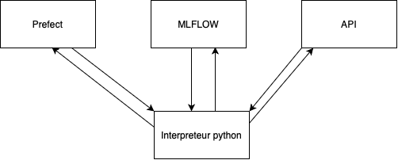
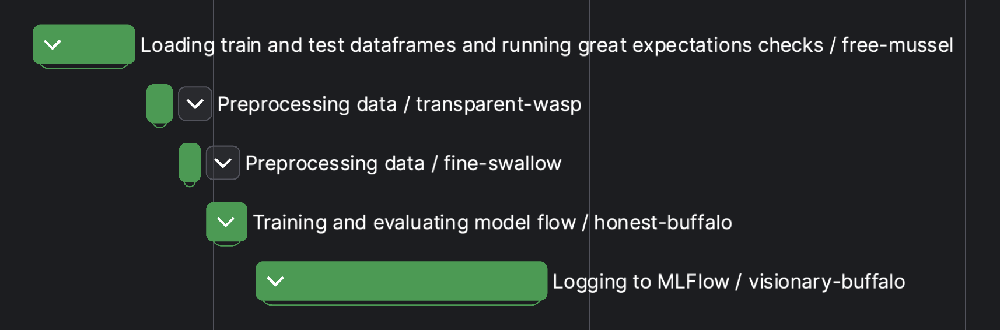
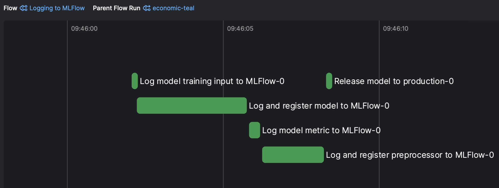
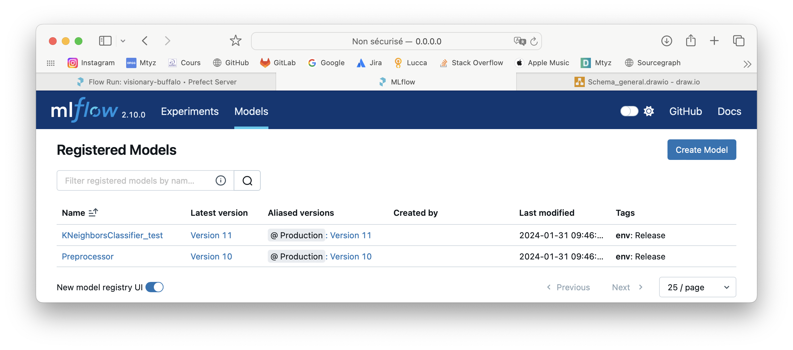

# Projet final 5MLDE 

## Prérequis 

Avoir docker et docker-compose d'installé sur sa machine.

Ports utilisés :
- 5000 : MLFlow
- 5001 : API
- 4200 : Prefect

## Lancer le projet

Lancer les commandes suivantes :
````shell
git clone https://github.com/baptdav/5MLDE_PROJ
cd infra
docker-compose up
````


Puis attendre ~2 minutes le temps de :
 - Construire les images docker
 - Démarrer les containers
 - Démarrer les services MLFlow et Prefect
 - Effectuer le déploiement du modèle

## Tests Great Expectations

Les tests great expectations permettent de vérifier que les données en entrée de notre modèle sont bien conformes à la définition de `code/expectations/ge.json`.

```json
// Exemple d'expectation
{
  "expectation_type": "expect_column_values_to_be_in_set",
  "kwargs": {
    "column": "housing",
    "value_set": [
      "yes",
      "no",
      "unknown"
    ]
  },
  "meta": {
    "description": "Housing loan status",
    "notes": "Valid values include yes, no, unknown."
  }
}
```

## Workflow Prefect



Les 2 subflows "Preprocessing data" correspondent à la préparation des données pour d'entraînement puis de test.

## Déploiements MLFlow

### Expériences

Le flow logging_flow permet de transmettre le modèle et ses métriques dans MLFlow.



#### Résultat dans MLFlow :
##### Experiments


##### Modèles disponibles



### À propos des modèles enregistrés

Si un modèle a une précision suffisante, alors il reçoit le tag "production" et est utilisé par l'API pour faire les prédictions.

```python
# main_flow.py
is_releasable: bool = model_dict['metrics']['global_accuracy'] > config.RELEASE_ACCURACY_THRESHOLD
mlflow_logging(input_infos=data_dict, model=model_dict['model'], preprocessor=train_data['preprocessor'],
                       metrics_dict=model_dict['metrics'], is_releasable=is_releasable)
```


## Liens utiles 

- MLFLOW : 
  - Experiments : http://localhost:5000/#/experiments/
  - Models : http://localhost:5000/#/models
- PREFECT : http://localhost:4200/
    - Dashboard : http://localhost:4200/dashboard
    - Deployments : http://localhost:4200/deployments
    - Flows : http://localhost:4200/flows
    - Flow runs : http://localhost:4200/flow-runs
- API PREDICT : http://localhost:5001/predict

## Exemple de requête pour appeler l'API du modèle et faire une prédiction : 

Requête
````shell
curl --location 'http://localhost:5001/predict' \
--header 'Content-Type: application/json' \
--data '{
    "age": 56,
    "job": "housemaid",
    "marital": "married",
    "education": "basic.4y",
    "default": "no",
    "housing": "no",
    "loan": "no",
    "contact": "telephone",
    "month": "may",
    "day_of_week": "mon",
    "duration": 261,
    "campaign": 1,
    "pdays": 999,
    "previous": 0,
    "poutcome": "nonexistent",
    "emp.var.rate": 1.1,
    "cons.price.idx": 93.994,
    "cons.conf.idx": -36.4,
    "euribor3m": 4.857,
    "nr.employed": 5191
}'
````
réponse
````json
{
    "will the client subscribe a term deposit ": "no"
}
````
